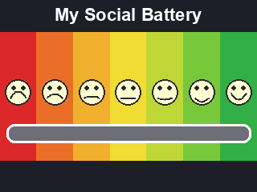

# My Social Battery

A tiny MicroPython app for the **GitHub Universe 2025 (Tufty) Badge**. It shows a "My Social Battery" gauge, seven mood faces from very sad (red) to very happy (green), with a marker you slide along the bottom to indicate how social you're feeling. You can also optionally display your GitHub handle or user specificed name.



## Usage

Move the diamond along the slider to set your current social battery level:

| Button | Action |
| ------ | ------ |
| **A** | Nudge the diamond left (1px per tap) |
| **C** | Nudge the diamond right (1px per tap) |
| **B** | Recenter the diamond |
| **UP / DOWN** | Cycle the name shown in the bottom bar |
| **HOME** | Exit back to MonaOS |

Hold **A** or **C** to keep sliding — the speed starts slow and gradually ramps up the longer you hold. Releasing the button resets the speed.

### Name in the bottom bar

The bottom black bar can show your name. Press **UP** / **DOWN** to cycle through the available modes:

1. **Handle** (default) — your GitHub handle, read as `GITHUB_USERNAME` from a `secrets.py` at the badge filesystem root.
2. **None** — no name shown.
3. **Custom name** — only offered if you set the `NAME` field near the top of `social_battery/__init__.py` script:

   ```python
   NAME = "Your Name"   # leave "" to just use your handle
   ```

## Install

Copy the `social_battery/` folder into `/BADGER/apps/` on the badge, unmount the badge, then launch the app from the MonaOS menu:


## Regenerating assets

The background and diamond images are generated by helper scripts, no need to regenerate for standard app use! (require [Pillow](https://python-pillow.org/)):

```bash
python3 make_battery.py   # renders social_battery.png (the gauge)
python3 make_assets.py    # produces the badge-sized assets and icon
```

## License

[MIT](LICENSE)

## Repository

https://github.com/Jeffrey-Luszcz/SocialBattery
